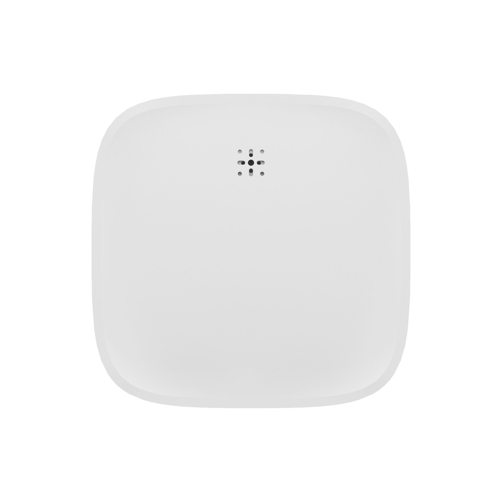
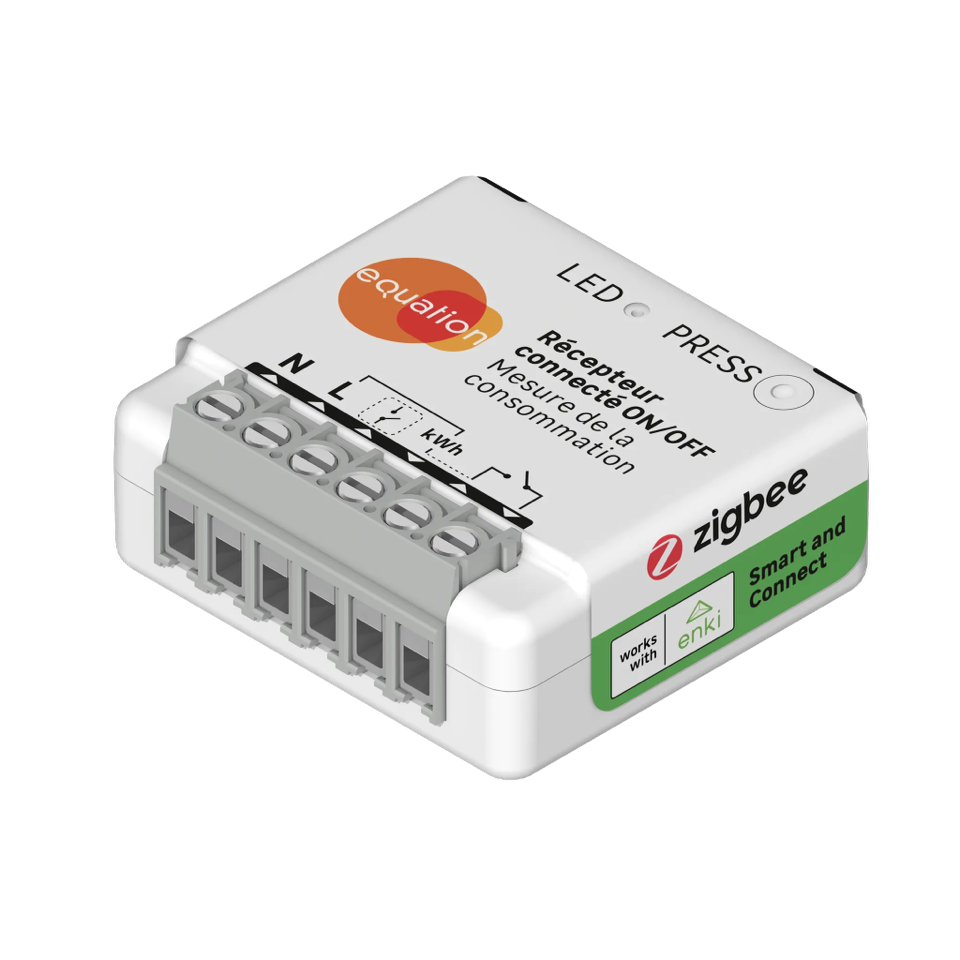
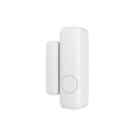
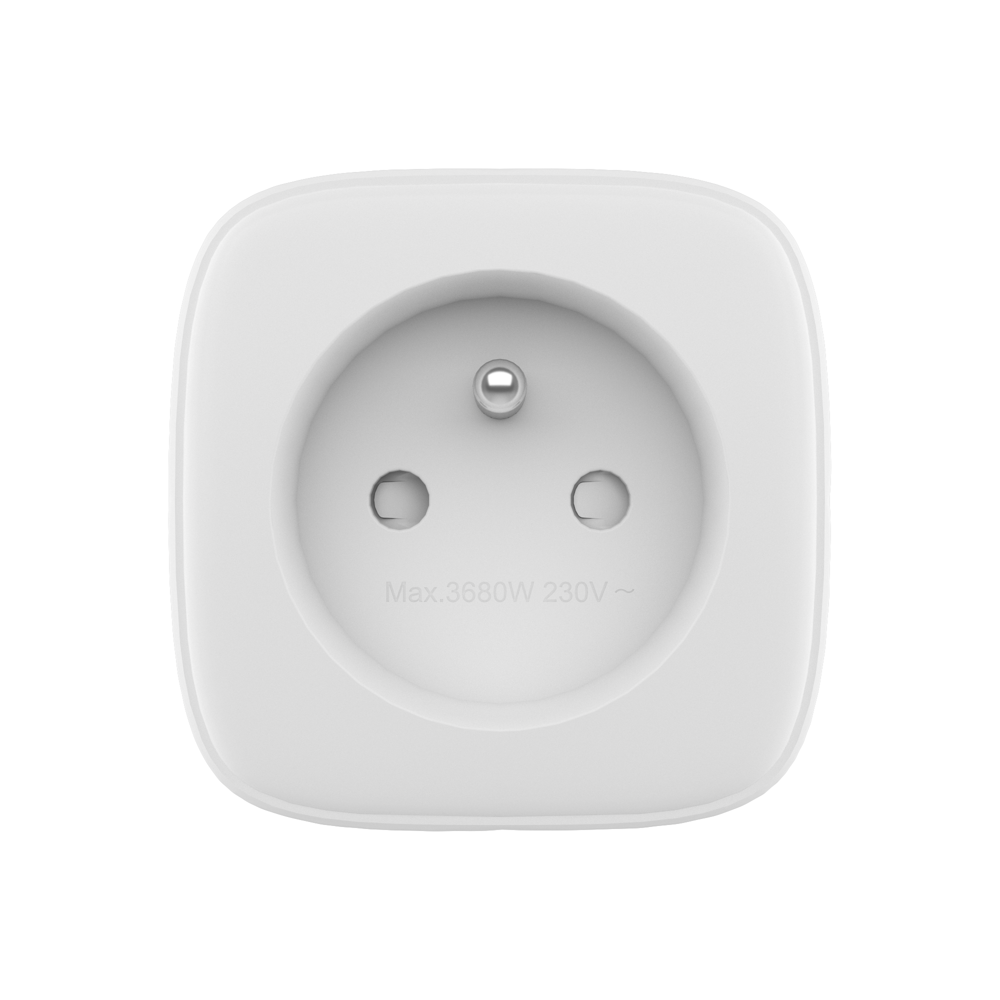
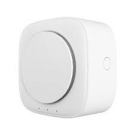
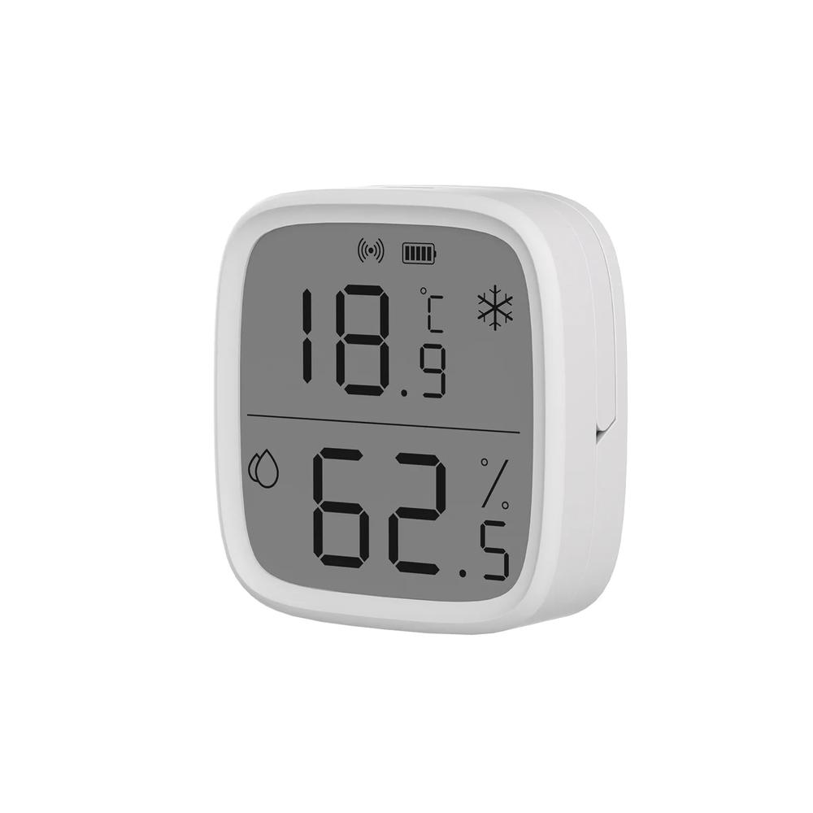
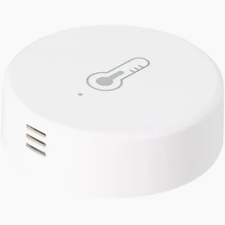
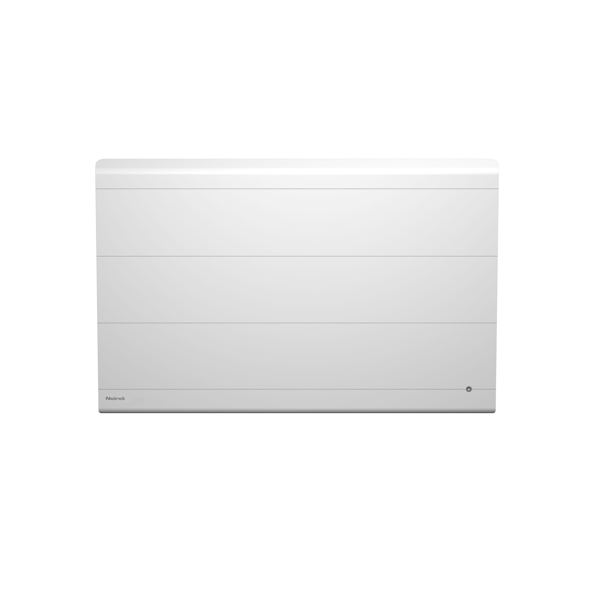
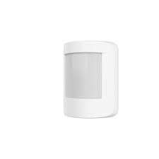

# Enki integration for Home Assistant (Unofficial)

<a href="https://my.home-assistant.io/redirect/hacs_repository/?owner=StephaneBranly&repository=ha-enki&category=integration"></a>

<p align="center">
  <a href="https://github.com/hacs/integration"></a>
  <a href="https://github.com/StephaneBranly/ha-enki/releases/latest"></a>
</p>
<p align="center">
 <a href="https://github.com/stephanebranly/ha-enki/blob/main/LICENSE"></a>
  <a href="https://github.com/stephanebranly/ha-enki/releases"></a>
</p>
<p align="center">
    
</p>
<p align="center">
    <a href="https://my.home-assistant.io/redirect/hacs_repository/?owner=StephaneBranly&repository=ha-enki&category=integration"></a>
</p>

Home Assistant integration for the Enki (by Leroy Merlin) smart home ecosystem.
Control lights, fans, switches, covers, sensors, security devices, scenarios, and more

<p align="center">
  <a href='#installation'>📦 Installation</a> •
  <a href='#connect-your-enki-account'>⚙️ Connect your enki account</a> •
  <a href='#tested-devices'>📱 Tested Devices</a> •
  <a href='#supported-capabilities'>🔌 Supported capabilities</a> •
  <a href='#check-compatibility-in-30-seconds'>🧪 Check compatibility in 30 seconds</a> •
  <a href='#contributing'>❤️ Contributing</a>
</p>


## Tested devices:

> [!TIP]
> Don't see your device in the list of tested devices?
>
> It may still work perfectly. The devices listed above are only those that have been explicitly tested by contributors.
>
> Many Enki devices share the same capabilities and protocols, meaning support can often extend to devices that have never been tested before.
>
> If you successfully use an unlisted device, please consider opening an issue or submitting a pull request to help improve compatibility information for the community.

<!-- start devices -->

| Name                                            | Image                                                                 | Id                         | Coverage (%)                          | Tested |
| ----------------------------------------------- | --------------------------------------------------------------------- | -------------------------- | ------------------------------------- | ------ |
| RGB E27 Light<br/>Lexman                        |  | _5d7df749f8bb0659f50d263d_ |    | ✅     |
| Water leak detector<br/>Lexman                  |   | _651eada55b3a798ef6b6bc5c_ |  | ❌     |
| ON/OFF relay<br/>Equation                       |   | _63a053851a423d4a245a877c_ |    | ❌     |
| Contact detector<br/>Lexman                     |   | _5f1192bc23b5dec92ac93eb4_ |    | ✅     |
| Outlet 16A, 3680A<br/>Lexman                    |  | _5e258991b472bf9d87b8483f_ |    | ✅     |
| Siren<br/>Lexman                                |   | _5f16c4aca80024b5af0561a1_ |    | ❌     |
| Thermometer with display<br/>Sonoff             |   | _6634999c9f53b36a99838c95_ |  | ❌     |
| Connected thermometer<br/>Sedea                 |  | _6633842c9f53b36a99838c94_ |  | ✅     |
| Cadix ceiling fan with light<br/>Inspire        |   | _6827098c5f52437f08d9d7a1_ |    | ✅     |
| Radiator<br/>Noirot                             |   | _67a4b12bae1eca4709a45680_ |      | ❌     |
| Motion detector<br/>Lexman                      |   | _5e26cc33777472061d55e340_ |  | ✅     |
| Lexman In-Wall Roller Shutter Module<br/>Lexman |                      | _622ad2122eab0cd7e5890eeb_ |    | ✅     |

<!-- end -->


In addition to physical devices, integration allows you to retrieve your scenarios and activate them using push buttons!


You can also access your Enki home security system—right from Home Assistant!

## Supported capabilities

Different device capabilities are curently being integrated to this custom component.

<details>

<summary>Capabilities coverage</summary>

<!-- start capabilities -->

| Capability                           | Coverage (%)                          |
| ------------------------------------ | ------------------------------------- |
| ENKI_HOMES_LIST                      |  |
| ENKI_BFF_ITEMS                       |  |
| ENKI_NODE_CAPABILITY                 |  |
| ENKI_SCENARIO_LIST_CAPABILITY        |  |
| ENKI_SCENARIO_ACTIVATE_CAPABILITY    |  |
| change_light_state                   |  |
| check_light_state                    |  |
| check_current_temperature            |  |
| check_current_humidity               |  |
| check_fan_speed                      |  |
| check_fan_rotation_direction         |  |
| check_airflow_mode                   |  |
| change_fan_speed                     |  |
| change_fan_rotation_direction        |  |
| change_airflow_mode                  |  |
| switch_electrical_power              |  |
| check_electrical_power               |  |
| check_battery_health                 |  |
| check_motion_detection               |  |
| check_motion_detector_state          |  |
| check_contact_sensor_state           |  |
| check_vibration_detection            |  |
| check_vibration_detection_activation |  |
| activate_vibration_detection         |  |
| check_contact_detection_activation   |  |
| activate_contact_detection           |  |
| check_vibration_sensibility_level    |  |
| change_vibration_sensibility_level   |  |
| check_siren_global_state             |  |
| switch_siren_status                  |  |
| check_roller_shutter_state           |  |
| change_shutter_position              |  |
| stop_change_shutter_position         |  |
| change_roller_shutter_mode           |  |
| check_water_sensor_state             |  |

<!-- end -->

</details>

## Installation

### Using HACS

1. Open HACS
2. Click "Custom repositories"
3. Add:

https://github.com/StephaneBranly/ha-enki

Category: Integration

4. Install the integration
5. Restart Home Assistant

### Configuration

Settings → Devices & Services → Add Integration → Enki

## Connect your Enki account

Reference your username and your password to connect to your Enki's account.

You can specifiy a refresh interval.

## Check compatibility in 30 seconds

This repository includes a standalone live diagnostics script that can authenticate against Enki
and print available devices/actions from your account. This can help to develop and debug the
component against the real API.

Before running it locally, install runtime dependencies:

```bash
python -m pip install aiohttp prettytable
```

Run the script with credentials as parameters:

```bash
python tools/enki_api_live.py --user "your-email@example.com" --password "your-password"
```

You can also use environment variables:

```bash
export ENKI_USER="your-email@example.com"
export ENKI_PASSWORD="your-password"
python tools/enki_api_live.py
```

Expected output

```bash
Fetching all devices...

Devices found: 15
+----+-----------------------+------------------------------+-----------+---------+--------+-----------------------+---------------+
| #  |          Name         |         Device type          | Device ID | Node ID | Status | Expected coverage (%) |   Protocols   |
+----+-----------------------+------------------------------+-----------+---------+--------+-----------------------+---------------+
| 1  |  Détecteur mouvements |           sensors            |    ...    |   ...   | Known  |          100          |     zigbee    |
| 2  |  Télécommande alarme  | remote_controls_and_switches |    ...    |   ...   | Known  |           0           |     zigbee    |
| 3  |       Ampoule 1       |            lights            |    ...    |   ...   |  NEW!  |           44          |     zigbee    |
| 4  |        Prise 2        |           outlets            |    ...    |   ...   | Known  |           28          |     zigbee    |
| 5  |         Caméra        |           cameras            |    ...    |   ...   | Known  |           0           | lexman_camera |
| .. |          ....         |             ...              |    ...    |   ...   |  ...   |          ...          |      ...      |
| 14 |   Thermomètre rouge   |           sensors            |    ...    |   ...   | Known  |          100          |     zigbee    |
| 15 |  Détecteur ouverture  |           sensors            |    ...    |   ...   | Known  |           90          |     zigbee    |
+----+-----------------------+------------------------------+-----------+---------+--------+-----------------------+---------------+

You have devices that haven't been listed or tested in this library yet.
Please submit a documentation PR to add them; you can add their names and include an image by editing the corresponding JSON files in the folder doc/devices

 - #3 > 5d7df749f8bb0659f50d263d (Ampoule 1)
```

---

## Contributing

This project is developed in my spare time and community contributions are always welcome.

Whether you want to improve the code, test new devices, report issues, improve translations, write documentation, or simply share feedback, your help is valuable.

No contribution is too small. Every bug report, device test, documentation fix, or pull request helps improve Enki support for everyone.

If you own an Enki-compatible device that is not yet listed, please consider running the diagnostic tool and opening an issue or submitting a pull request.
Let's build the best Enki integration for Home Assistant together

> [!NOTE]
> This repository is based on the excellent [CyrilP/hass-enki-component](https://github.com/CyrilP/hass-enki-component) repository, which did not appear to be maintained in a consistent and sustainable manner.
